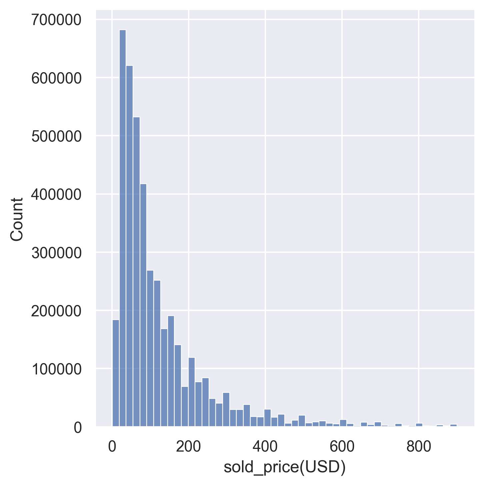
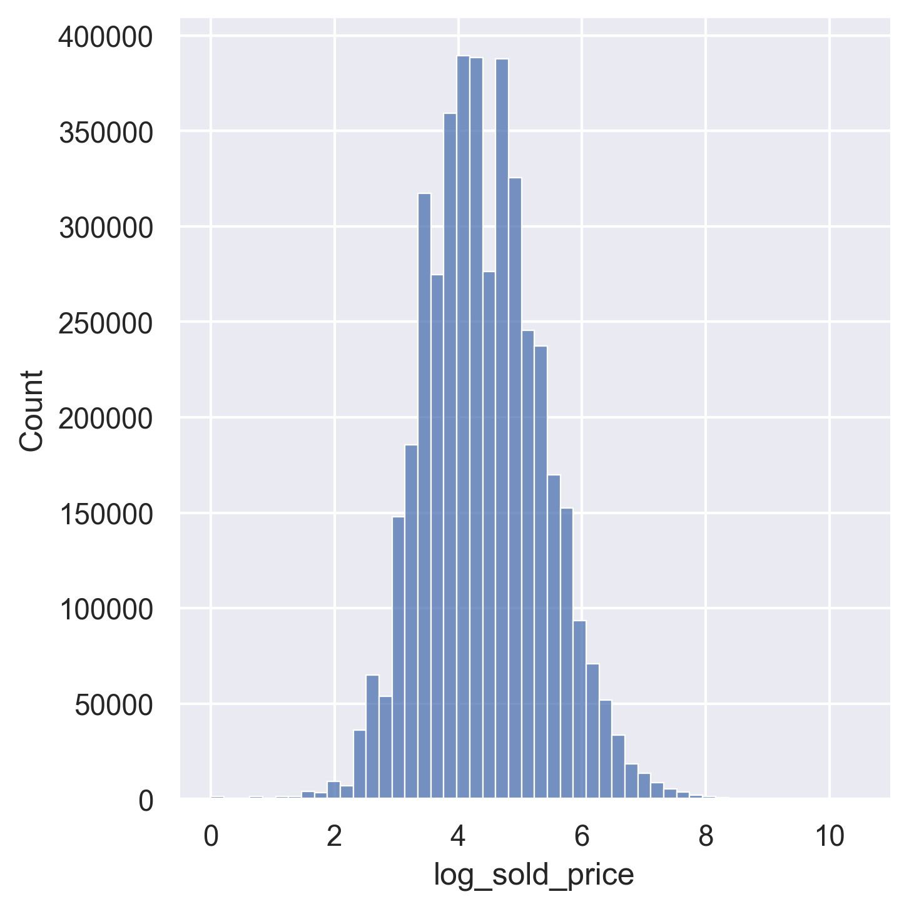

# GrailedDataAnalysis
# Price prediction for fashion resale on 4.3M scraped Grailed sold listings.
# 1. Rationale
  Motivation for creating/trainig this model is that I resell and buy clothes on a frequent bas es 
  and I wanted to get better perspective for the price of an item I sell or buy. 
# 2. Data
  4.35M sold listings scraped from Grailed covering Aug 2021 – Mar 2026, ~93% Grailed's public sold index as of Sept. 2026. For the scraper I used Java, here is the [repo] (https://github.com/mononoawaree/GrailedScraper.git)
# 3. Methodology
    The target is log(sold_price). Two reasons. Errors in resale pricing are multiplicative, not additive — being $50 off on a $100 item is a much worse mistake than being $50 off on a $1,000 item, but plain RMSE treats them identically.
 
    In log space both become the same distance. 
    Second, the price distribution is heavy-tailed (median $80, max $35,000), so squared error on raw dollars would be dominated by a few expensive listings.

    For the model I picked LightGBM - gradient boosting framework based on decision tree algorithms because features are mostly 
    heterogeneous, high-cardinality categoricals, so there is no need for scaling, and GBDTs remain the strongest baseline on tabular data neural alternatives mostly fail to beat them.
  
    For validation I used 13 monthly walk-forward folds (train on everything before month N - test on N). For leakage check I used scramble test.
# 4. Results
  | model | RMSE | within 20% |
  |---|---|---|
  | constant | 1.060 | 17.1% |
  | designer × category mean | 0.712 | 25.2% |
  | 11 structured features | 0.6086 | 31.1% |
  | + season/year from titles | 0.6031 | 31.4% |
  | + TF-IDF titles | 0.5322 | 35.2% |
  | + FashionCLIP embeddings | 0.5181 | 36.0% |